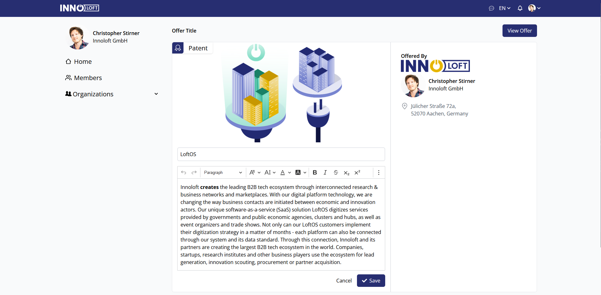

# React Dashboard App

To set up this application you need to rename the `.env.example` file to `.env` and add the proper environment variables.

```
.env

VITE_MAPBOX_API_KEY=<VITE_MAPBOX_API_KEY>
APP_ID=<APP_ID>

```

You can get the API Key for Mapbox here otherwise it will not work.

[Get Mapbox API Key](https://www.mapbox.com/)

Here are some screenshots of the project.



